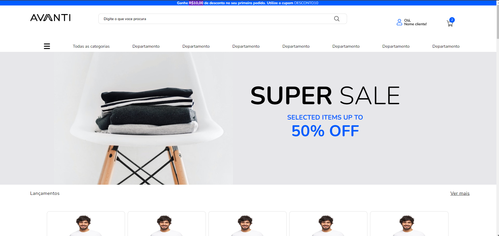
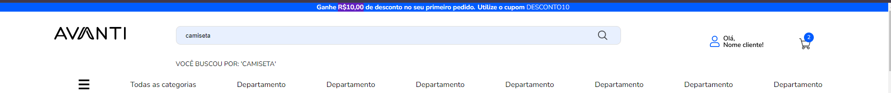

# Teste tecnico para estágio Avanti 
 
## Descrição do Projeto
Projeto desenvolvido como desafio final, com o objetivo de recriar um layout do Figma utilizando HTML, CSS (com responsividade para Desktop e Mobile) e JavaScript para funcionalidades interativas.

🔗 Acesse o layout original no Figma:
[Figma - Innovation Class] (https://www.figma.com/proto/DqtFxC6312M32mLt8FpJjq/innovation-class?page-id=13%3A673&node-id=13-920&viewport=346%2C140%2C0.11&t=HyGGDSs83f1vbqMJ-1&scaling=scale-down&content-scaling=fixed)

## Prévia do site:

## Para visualizar o projeto completo, faça o clone desse repositório utlizando o seguinte link: 

https://github.com/carolinabispo/teste-tecnino-avanti.git

✅ Requisitos Atendidos

1️⃣ Estrutura HTML

O HTML foi estruturado tentando seguir ao máximo o layout proposto no Figma, respeitando a hierarquia de elementos, seções e componentes visuais.

2️⃣ Estilização com CSS

O layout foi estilizado com CSS responsivo, garantindo boa usabilidade tanto em Desktop quanto em Mobile, conforme as versões disponibilizadas no Figma.

3️⃣ Funcionalidade de Busca com JavaScript

Foi implementada uma função em JavaScript que:

Captura o valor inserido no campo de busca;

Exibe a seguinte mensagem abaixo do campo ao clicar na lupa:
👉 "Você buscou por: 'assunto buscado'" como na imagem abaixo: 

4️⃣ Interação com Carrosséis
Os carrosséis do layout possuem interação funcional, utilizando o próprio CSS para dos elementos e compatibilidade com dispositivos móveis.

